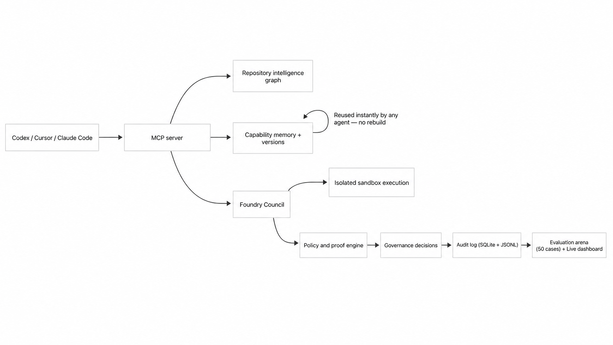
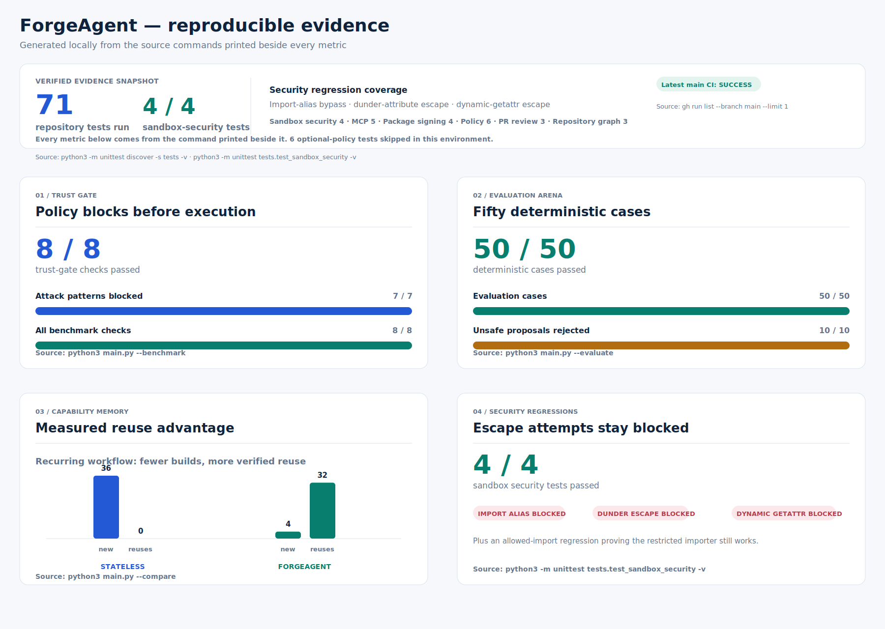

# ForgeAgent — verified skill memory for AI agents

ForgeAgent helps AI coding agents and developer teams turn generated code into verified, reusable capabilities before it is allowed to run again.

<!-- demo video goes here once recorded -->

Here, an agent forges a capability once, verifies it, then reuses the proven version instead of regenerating it.

```text
TASK  Normalize inconsistent date formats in this import log
GAP    I need 'date_format_normalizer', and I do not have it. I will build it.
BUILD  Generated executable tool: date_format_normalizer
TEST   Running mandatory sample test in isolated sandbox...
VERIFY ✓  Sample test passed. REGISTER ✓  Toolkit now has 1 verified tool(s).
RUN    Executing date_format_normalizer on task input...
DONE   Result produced by verified tool.
"job=ledger 2026-07-03; job=payout 2026-07-04; job=archive 2026-07-05"

TASK  Normalize inconsistent date formats in this import log
REUSE ✓  Found verified tool: date_format_normalizer
RUN    Executing date_format_normalizer on task input...
DONE   Result produced by verified tool.
"job=ledger 2026-07-03; job=payout 2026-07-04; job=archive 2026-07-05"
```

## The hook story

A generated capability could alias `__import__` and attempt to bypass the sandbox policy gate. ForgeAgent closes that class twice: a static AST check rejects it before execution, and the runtime replaces imports with the `safe_import` allowlist in [`sandbox.py`](sandbox.py); both protections are exercised by [`tests/test_sandbox_security.py`](tests/test_sandbox_security.py).

AI agents are increasingly allowed to write and run their own code; without a system like this, that trust is assumed, not earned.

## Demo video

▶ **Demo video — link coming soon**

<!-- Paste the real YouTube embed or walkthrough link here before submission. -->

## Architecture

This is the runnable local system: agents reach an MCP server, governed capabilities are proved and remembered, and later agents can reuse trusted work without rebuilding it.



## Proof at a glance

All figures below were generated locally without an API key on July 17, 2026.

| Evidence | Measured result | Source command |
| --- | --- | --- |
| Regression suite | 42/42 tests passed | `python3 -m unittest discover -s tests -v` |
| Trust-gate benchmark | 8/8 cases passed; 7/7 attack patterns blocked | `python3 main.py --benchmark` |
| Evaluation arena | 50/50 cases passed; 10/10 unsafe proposals rejected | `python3 main.py --evaluate` |
| Stateless comparison | 36 new skills; 0 reuses | `python3 main.py --compare` |
| ForgeAgent comparison | 4 new skills; 32 reuses | `python3 main.py --compare` |

The chart is generated from those commands, not hand-entered metrics. Regenerate it with `python3 scripts/generate_benchmark_chart.py`.



### Raw command evidence

These files are the exact, unedited stdout captured from the commands named beside them—not summaries or hand-copied metrics: [`benchmark.json`](docs/evidence/benchmark.json) (`python3 main.py --benchmark`), [`evaluate.json`](docs/evidence/evaluate.json) (`python3 main.py --evaluate`), and [`compare.json`](docs/evidence/compare.json) (`python3 main.py --compare`).

## Quickstart

Python 3.10+ is the only requirement for the offline judge path—no packages or API key are needed.

```bash
git clone https://github.com/Yashasm18/ForgeAgent.git
cd ForgeAgent
python3 main.py --demo --reset && python3 main.py --demo
python3 -m unittest discover -s tests -v
```

The first command forges curated offline capabilities after proof; the second demonstrates their verified reuse. For the local visual ledger, run `python3 main.py --serve` and open `http://127.0.0.1:8787`.

## What's implemented

| Capability | What is real now | Where to verify it |
| --- | --- | --- |
| Governed capability lifecycle | Propose, policy-check, isolate, prove, persist, version, and reuse constrained `run(payload)` capabilities. | [`foundry.py`](foundry.py), [`proof_engine.py`](proof_engine.py), `python3 main.py --foundry-task "Normalize inconsistent date formats in this import log" --payload '{"text":"batch=A 03/07/2026"}'` |
| Cross-agent reuse | A capability approved by one real MCP subprocess is reused by a separate OS process from the SQLite platform store. | [`tests/test_mcp_server.py`](tests/test_mcp_server.py) |
| Adversarial proof | An opt-in live GPT-5.6 adversarial pass creates contract-breaking cases; a failure blocks promotion and enters repair evidence. A labelled offline recorded example is also included. | [`generator.py`](generator.py), [`proof_engine.py`](proof_engine.py), [`demo_tasks.py`](demo_tasks.py) |
| Semantic matching | When a live generator is configured, existing capabilities are matched by task intent; unavailable or failed live matching falls back to the existing offline keywords. | [`agent.py`](agent.py), [`generator.py`](generator.py) |
| Structured outputs | The three live GPT-5.6 calls enforce JSON Schemas through the Responses API before parsing. | [`generator.py`](generator.py) |
| Live Foundry Council | The dashboard polls newly appended council decisions from the SQLite + JSONL audit trail while a Foundry run is active. | [`dashboard.py`](dashboard.py), [`audit.py`](audit.py), `python3 main.py --serve` |
| Accurate proof evidence | Capability records persist the actual passing proof-case count; the dashboard shows evidence unavailable rather than inventing a fallback value. | [`registry.py`](registry.py), [`dashboard.py`](dashboard.py) |
| Reproducible evaluation | The benchmark chart is regenerated from the local benchmark, evaluation, and comparison commands. | [`scripts/generate_benchmark_chart.py`](scripts/generate_benchmark_chart.py) |
| Production reference profile | An optional rootless, no-egress container profile and stricter approval policy are available for validation. | [`Dockerfile.sandbox`](Dockerfile.sandbox), [`compose.production.yml`](compose.production.yml) |

## Live judge demo

**[Open the Forge Ledger →](https://yashasm18.github.io/ForgeAgent/?v=3bd7ed2)** — a no-install walkthrough with the clickable **ForgeGraph**, browser capability run, Policy Attack Lab, version lineage, and Production Preflight.

## Capability Foundry

ForgeAgent is now a **Capability Foundry**: a governed learning layer for
coding agents rather than a prompt-only assistant. Given a task, it builds a
repository intelligence graph, identifies whether a trusted capability already
exists, produces a constrained proposal, creates a threat model, runs proof
cases in isolation, records a governed decision, and either executes the
trusted capability or keeps the rejected evidence for review.

The Foundry Council makes that lifecycle explicit:

- **Planner** maps a task to a capability gap and dependency impact.
- **Builder** creates a constrained `run(payload)` tool.
- **Security** derives a threat model and checks the static policy boundary.
- **Evaluator** runs normal, edge, and contract proof cases in an isolated subprocess.
- **Governor** promotes, holds for review, rejects, or rolls back a version.

The local-first control plane uses SQLite for project namespaces, trust scores,
proof reports, approval decisions, audit receipts, and signed capability
packages. An optional live generator uses `gpt-5.6-terra`; the complete
offline lifecycle remains runnable without an API key.

## Why it matters

An agent can now get better over time without quietly accumulating unverified
code. Every saved skill has source, deterministic test evidence, provenance,
reuse history, and an append-only decision record. Broken or policy-violating
candidates are rejected before they can enter memory.

## Isn’t this just caching?

No. Memoization stores an answer for an identical input; ForgeAgent stores a
**capability version** only after it earns reusable evidence. A blind
LLM-code cache would save source because it was generated. ForgeAgent instead:

- runs normal, edge, and contract proof categories in
  [`proof_engine.py`](proof_engine.py) before trust;
- applies sensitivity and production approval policy in
  [`governance.py`](governance.py), rather than treating a passing string
  transform and an external action alike;
- preserves version lineage and rollback rather than overwriting history; and
- routes a candidate replacement through the same policy-and-test path in
  [`agent.py`](agent.py) and [`foundry.py`](foundry.py) before
  `ToolRegistry.replace` can supersede a trusted version.

The result is capability governance, not cached model output: source,
provenance, tests, policy decision, approval, and rollback state travel with
the reusable tool.

## Who uses it and when

- **Coding agents and developer teams:** avoid regenerating a parser, validator,
  normalizer, or extractor that has already been proven for the project.
- **Support and operations agents:** redact incident data before routing,
  risk-triaging, or extracting recurring failure themes.
- **Security-conscious teams:** keep unsafe tool proposals as rejected evidence
  and require named approval before sensitive or production capability reuse.
- **Platform teams:** export a proof-backed capability package, then import it
  into another project where it starts in review rather than becoming trusted.

Example: an agent needs an invoice-ID extractor. ForgeAgent first checks
existing capability memory and repository context. If the capability is
missing, it produces a constrained `run(payload)` proposal, attacks it with
policy/proof checks, repairs it when possible, versions it after approval, and
reuses only the trusted version on the next request.

## Quick demo (no API key)

```bash
python3 main.py --demo --reset
python3 main.py --demo
python3 main.py --serve
python3 main.py --benchmark
python3 main.py --foundry-task "Extract structured error codes and line numbers from this stack trace" --payload '{"text":"ERROR E_CONN_TIMEOUT at ingest.py:line 42"}'
python3 main.py --repo-graph
python3 main.py --evaluate
python3 main.py --mcp
python3 main.py --showcase --reset
python3 main.py --autonomy-demo --reset
python3 main.py --autonomy-demo
python3 main.py --compare
```

Open `http://127.0.0.1:8787` to see the **Forge Ledger**. The first demo run
creates curated offline skills; the second proves that verified memory is
reused. The curated mode is intentionally labelled as a recording fallback—it
does not claim to be a live model call.

`--foundry-task` runs the five-role council. With a supported capability it
uses the offline proposal path; add `--foundry-live` and `OPENAI_API_KEY` to
let `gpt-5.6-terra` plan and propose an unknown capability. `--repo-graph`
exports the repository graph, `--evaluate` runs 50 measured cases, and `--mcp`
starts the stdio MCP server for compatible coding agents.

### Optional live adversarial proof

`--adversarial-proof` is deliberately opt-in and requires `--foundry-live` plus
`OPENAI_API_KEY`. After the builder proposes a candidate, a second GPT-5.6 call
must return 2–4 JSON adversarial cases targeted at that candidate’s contract.
ForgeAgent runs those cases through the same isolated sandbox as normal, edge,
and contract proof. Any mismatch or exception blocks promotion and becomes
repair evidence. If live adversarial generation is requested without a usable
live generator, the run fails closed; it never silently skips the category.

For a key-free explanation, [`demo_tasks.py`](demo_tasks.py) includes a clearly
labelled recorded offline example where a slug normalizer passes its regular
cases but fails an adversarial repeated-whitespace case. The regular `--demo`,
`--benchmark`, `--evaluate`, and `--compare` flows make no API calls and remain
fully offline.

### Choose a run mode

| Goal | Command | What to look for |
| --- | --- | --- |
| Fast offline proof | `python3 main.py --demo --reset` | Curated skills are created only after proof. |
| Reuse proof | `python3 main.py --demo` | The second run reuses verified skills. |
| Foundry council | `python3 main.py --foundry-task "Normalize inconsistent date formats in this import log" --payload '{"text":"batch=A 03/07/2026"}'` | Council decisions, proof, and governed memory record. |
| Evaluation evidence | `python3 main.py --evaluate` | Actual output across 50 deterministic cases. |
| Repository intelligence | `python3 main.py --repo-graph` | Queryable code/docs graph export. |
| Developer-tool mode | `python3 main.py --mcp` | MCP server over standard input/output. |
| Browser demo | `python3 main.py --serve` | Local Forge Ledger dashboard. |

## Production isolation and approvals

The default local runner is intentionally frictionless for the judge demo. For
an actual deployment, ForgeAgent now has a strict container profile: it runs a
single candidate with **no host mounts, no forwarded environment secrets, no
network egress, a read-only filesystem, dropped Linux capabilities, no-new-
privileges, PID/CPU/memory limits, and a non-root user**.

```bash
docker build -f Dockerfile.sandbox -t forgeagent-sandbox:local .
FORGEAGENT_SANDBOX=container FORGEAGENT_REQUIRE_CONTAINER=1 \
  python3 main.py --foundry-task "Normalize inconsistent date formats in this import log" \
  --approval-policy production --payload '{"text":"batch=A 03/07/2026"}'
```

`compose.production.yml` is a deployable reference profile. The
`production` approval policy never auto-promotes: even a passing low-risk
candidate remains pending until a named reviewer records a substantive reason.
Policy violations are rejected, and receipts include an integrity SHA-256
digest without storing raw incident payloads. In a real deployment, run this
worker on a dedicated hardened host or orchestration runtime as an additional
boundary against container escapes.

### Test the production profile

Start Docker Desktop, then run:

```bash
docker build -f Dockerfile.sandbox -t forgeagent-sandbox:local .
FORGEAGENT_SANDBOX=container FORGEAGENT_REQUIRE_CONTAINER=1 \
  python3 -m unittest discover -s tests -v
```

The production-control tests verify that the generated Docker command has no
network and no host volumes, strict mode refuses the local fallback, production
does not silently reuse legacy skills, named human approval is required, and
audit receipts receive an integrity hash.

## Hosted judge demo

`demo/` is a no-install, static Forge Ledger designed for the Devpost
**judge-testing** field. It follows a short judge path: inspect the capability
graph, run a private incident through the trusted chain, then inject a bad
candidate in the **Policy Attack Lab**, then run **Production Preflight**. The
interactive run performs
deterministic PII redaction, risk triage, and feedback-term extraction in the
browser. Neither requires an API key.

The Production Preflight is deliberately transparent: it simulates and displays
the same admission contract as the repository (rootless runtime, no host
mounts, disabled egress, resource limits, and named-human approval), but does
not claim that a browser itself can enforce OS-level container isolation.

The interactive redactor removes emails, phone numbers, card-like values, and
explicitly labelled secrets such as secret codes, passwords, OTPs, API keys,
access tokens, and secret messages. `incident_analysis.py` provides the same
structured, audit-safe analysis path for arbitrary incident text in Python.

Use the hosted demo here:

```text
https://yashasm18.github.io/ForgeAgent/?v=4cd9ee3
```

The versioned URL bypasses any cached GitHub Pages 404 response. GitHub Pages
deploys the static `demo/` directory through the repository workflow. The full
local ledger remains available through `python3 main.py --serve`.

The dashboard now also shows the **Evidence Trail**: every capability request,
policy rejection, verification result, trusted reuse, and execution is stored
in `data/audit_log.jsonl`.

`--benchmark` evaluates the trust gate against safe code, filesystem access,
network access, dynamic execution, and broken-tool-contract cases. `--showcase` is the recording-ready workflow: redact sensitive
support data, explain customer risk, and reuse those proven capabilities on the
next pass.

## Capability Graph and task recovery

ForgeAgent's capability graph is its native memory model. It maps user tasks
to capability gaps, verified skill versions, proof evidence, dependencies,
repairs, supersessions, and rollbacks. It is not a generic codebase graph: it
answers **why this agent can safely perform this task now**.

`--autonomy-demo` runs a dependent incident workflow. Each step first looks
for an active trusted skill. A gap triggers forging; a failed proposal triggers
up to two repair attempts; only a repaired candidate that passes every test is
promoted. Verified replacement versions retain the older version for rollback.

`--compare` executes the same multi-step workflow twice as a stateless agent
and twice with ForgeAgent's persistent memory, reporting new-skill creation,
reuse, and elapsed time.

With an OpenAI API key, ForgeAgent can also receive an unknown user task and
ask GPT-5.6 to produce the dependency plan itself:

```bash
python3 main.py --autonomous-task "Redact this incident, assess its customer risk, and summarize recurring terms" \
  --payload '{"text":"Ava at ava@example.com cannot access the dashboard and may cancel."}'
```

For each planned step, a missing capability triggers code-and-test generation;
a failed candidate triggers repair attempts; an accepted repair creates a new
version while preserving the earlier trusted version for rollback.

## Live GPT-5.6 forge

Set an OpenAI API key, then ask ForgeAgent for a genuinely new capability:

```bash
export OPENAI_API_KEY="your-key"
python3 main.py --forge "Extract order IDs, normalize their case, and return unique values" \
  --payload '{"text":"Orders: ab-12, AB-12 and xy-99"}'
```

ForgeAgent asks GPT-5.6 to return a constrained `run(payload)` function plus
edge-case tests. It performs AST policy checks and runs every test in a fresh,
timeout-bounded subprocess. Only a passing candidate is stored in
`data/tool_registry.json` and becomes reusable.

## Test

```bash
python3 -m unittest discover -s tests -v
```

The evaluation arena is intentionally evidence-first: it runs 50 deterministic
cases (10 allowed tools, 10 unsafe proposals, and 30 privacy-first incidents),
reports actual pass/fail, latency, and blocked proposals, and reports API cost
as `null` when no model call was made.

## Continuous integration and deployment

GitHub Actions continuously watches the repository through
[`ci.yml`](.github/workflows/ci.yml): every push and pull request to `main`
runs the full proof suite, compiles Python, validates the hosted-demo
JavaScript, checks production assets, builds the rootless sandbox image, and
executes a small no-egress container capability. A scheduled daily health run
catches environmental regressions even when no one is pushing code.

[`pages.yml`](.github/workflows/pages.yml) is the deployment gate. Any update
to the hosted demo, Python runtime, or workflow first runs the proof suite and
demo JavaScript check; only then can it publish the `demo/` directory to GitHub
Pages. GitHub Actions is event-driven rather than a permanent process, so this
combination of push/PR events, a scheduled run, and protected deployment is
the practical “24/7 watch” for a hackathon repository.

## MCP and capability packages

`mcp_server.py` exposes a stdio MCP interface for repository inspection,
capability memory, audit receipts, and human approval decisions. Copy
[`mcp.config.example.json`](mcp.config.example.json), substitute the absolute
repository path, and register it in a compatible client such as Codex, Cursor,
or Claude Code.

Capability package signing is optional and is the only feature that needs the
maintained `cryptography` package:

```bash
python3 -m pip install -r requirements-signing.txt
```

`PlatformStore.generate_signing_keypair()` creates an Ed25519 demo keypair;
an export is signed by its private key and an import verifies against a trusted
public key. Package metadata includes a signer key ID, package ID, and schema
compatibility range. Revoked signer keys or package IDs are rejected before
import. The local keypair is a hackathon demonstration only—production keys
should be held and rotated by a KMS/HSM or equivalent key-management system.
Imports always enter review state in the receiving project; they cannot
silently become trusted. The offline demo, benchmark, evaluation, MCP server,
and dashboard do not import or require this optional package.

## Optional project policy

Teams can commit a `forgeagent-policy.yml` to make a project more restrictive.
Loading that file is optional and requires only this feature's dependency:

```bash
python3 -m pip install -r requirements-policy.txt
```

```yaml
allowed_imports:
  - json
required_proof_categories:
  - adversarial
auto_promotion_rules:
  require_human_review: true
trusted_signer_keys:
  - "ed25519-public-key-id"
```

The file can only narrow the hardcoded floor: effective imports are the
intersection of the baseline and `allowed_imports`; required proof categories
are the union of the baseline and `required_proof_categories`; and promotion
or deployment rules can only add a named-human review hold. Trusted signer
keys only narrow package imports. If the file is absent, malformed, or PyYAML
is unavailable, ForgeAgent uses the unchanged hardcoded baseline.

## Control plane and coding-agent integration

ForgeAgent now includes MCP v2 tools for requesting a capability, reusing a
trusted one, checking approval state, and reading audit-safe metrics. It also
ships a local authenticated control-plane API with project roles (`viewer`,
`developer`, `reviewer`, `admin`, `owner`) and expiring hashed bearer tokens.

```bash
python3 main.py --api
```

The API binds to loopback by default and is intended for local development or
a trusted gateway. See [developer integration and API instructions](docs/INTEGRATIONS.md)
for Codex, Cursor, Claude Code, role rules, curl examples, and the remote
deployment boundary.

## Repository map

- `foundry.py` — five-role council and governed capability lifecycle.
- `repository_graph.py` — local code/docs intelligence graph and impact hints.
- `proof_engine.py` — deterministic/adversarial evidence and trust scoring.
- `platform_store.py` and `governance.py` — SQLite memory, approval decisions,
  receipts, packages, and production policy.
- `sandbox.py`, `container_runner.py`, `Dockerfile.sandbox` — local and
  hardened container execution profiles.
- `compose.production.yml` — production runtime reference configuration.
- `mcp_server.py` — MCP developer-tool surface.
- `control_plane.py` and `api_server.py` — tenant roles, hashed tokens,
  authenticated API contracts, and audit-safe metrics.
- `Dockerfile.control-plane` — rootless control-plane container profile.
- `demo/index.html` — hosted, no-key judge experience.

## Safety scope

This is defense in depth for a hackathon project, not hardened containment for
hostile code. Local generated tools run in a fresh subprocess with a timeout,
a temporary working directory, a minimal environment, a restricted builtins
set, and an import/operation policy. The production profile adds a rootless,
read-only container with disabled network egress and constrained resources.
The policy gate is exposed separately before execution and every decision is
recorded. A true hostile-code deployment also needs a hardened host, image
patching, runtime monitoring, and real organisational approval policy.

## OpenAI Build Week evidence

ForgeAgent is entered in **Developer Tools**. See [HACKATHON_SCOPE.md](HACKATHON_SCOPE.md)
for the boundary between the earlier prototype and Build Week work.

Codex accelerated the architecture, safety lifecycle, dashboard, tests, and
submission materials. GPT-5.6 can be used at runtime, with server-side API
credentials, to propose constrained tool code and deterministic test cases.
The hosted GitHub Pages demo is deliberately key-free and uses no live model
call. The demo video will show both the successful forge path and a deliberate
policy/test rejection.

## Judge testing path

- Supported platform: macOS, Linux, or Windows with Python 3.10+.
- Dependencies: none beyond the Python standard library.
- Offline proof: `python3 main.py --demo --reset`.
- Live GPT-5.6 proof: set `OPENAI_API_KEY` and use `--forge` as above.
- Visual inspection: `python3 main.py --serve`.
- Verification snapshot: `python3 -m unittest discover -s tests -v`.
